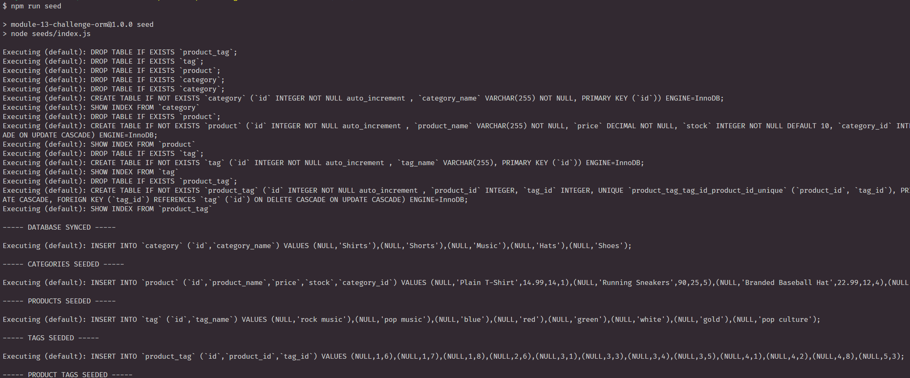
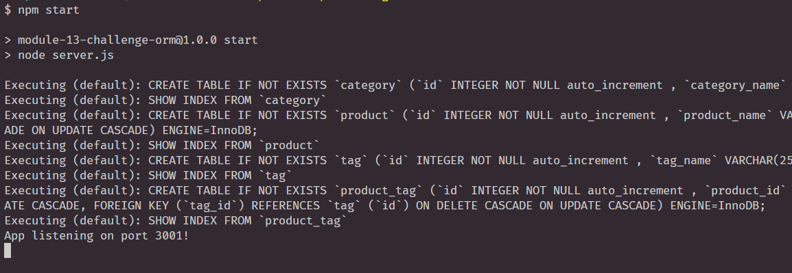
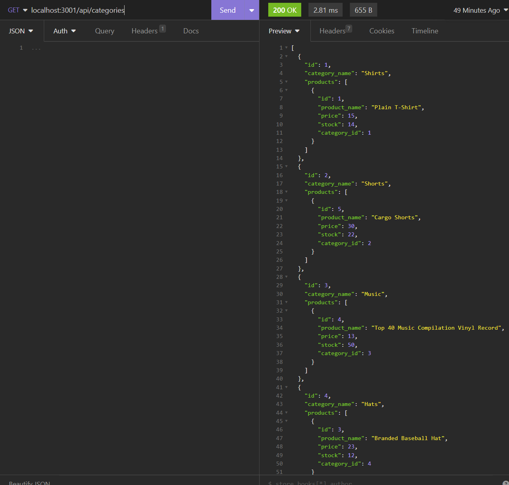
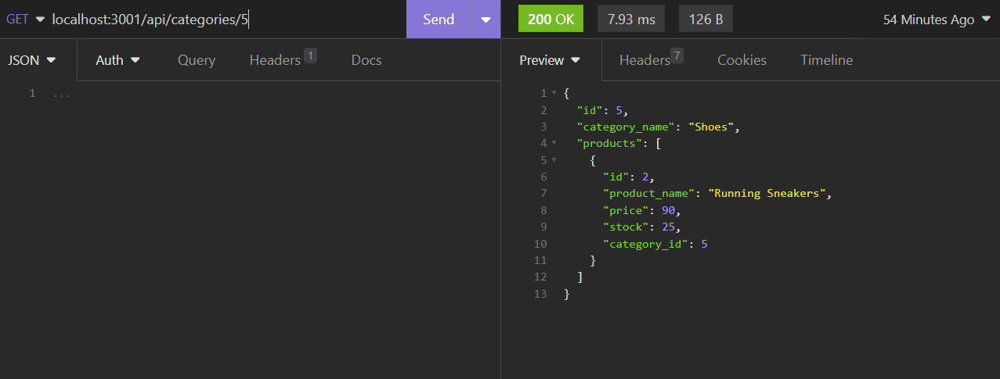
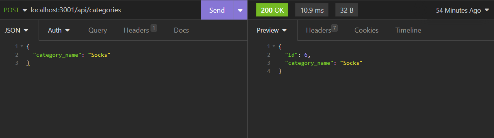
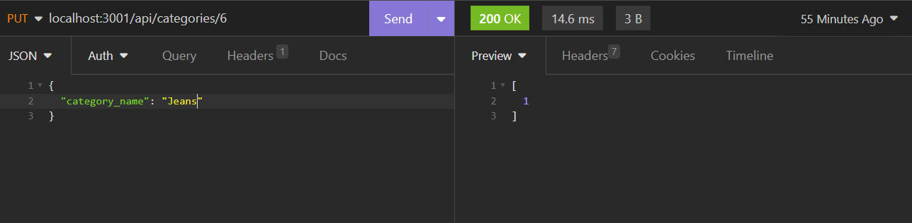
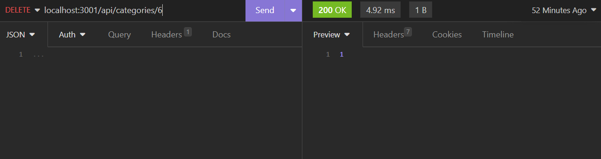

# E-Commerce Back End 
By: Thandyn
Email: nguyenphuthan@gmail.com

## Description
This project focuses finishing the rest of a developed code. I had to add models and define each items. In the "index.js" in the models folder, I had to associate each item to each other using sequelize.  Then, using the Express package, I added routes to each item so I could interact with them in Insomia.

## Table of Content 
  - [Installation](#installation)
  - [Usage](#usage)
  - [Questions](#questions)
  - [License](#license)
  - [Contribute](#contribute)
  - [Test](#test)
  - [Link](#Link)

## Installation
To install all the packages. Run "npm i" in the terminal. It will install dotenv, express, mysql2, and sequelize. Make sure to include user's username and password in the ".env" to connect it to user's mysql. 

## Usage
Before user begin to use the application, user would have to create a database on their local mysql. Then install the packages that is included in the files. 

To start, populate your database with the seed. This way, user may see information ahead of time and intereact with it in Insomnia. 

Next is to start the server by entering "npm start". The server will start listening to any request. Then open up Insomnia. 

Once Insomnia is open. Users may start testing routes. To use "GET", users will have to enter "localhost:3001/api/" follow up with an endpoint. In this example, we're getting information from categories. Switch the request to GET and click send and data will start showing. 

If users want to grab an object by their ID number, make sure to include the ID number after the endpoint. For this example, we got the object with 5 as their ID. 

To add data, change the request to POST and underneath, users may enter the item's information. After filling out the information, click on SEND to add that to the database. 

To update any data in the database, switch the method to PUT and underneath, fill out any changes user may want. After filling out the change in the information, click on send. 

Finally, to delete data, Enter the ID of what item user wishes to delete. Click on SEND and the data will be deleted. This works for all the Data types. Try them all out! 

## License
MIT

## Contribute
If you would like to contribute to this project. Please contact me through my email. 

## Test
If users would like to test the application. Open up terminal and enter "npm run seed" to populate the database. Then start the server by entering "npm start". After the server listening, open up Insomnia and users may start testing in there. User can modify any data on their local. 

## Questions
If you have any questions, please email me at: nguyenphuthan@gmail.com. 
For more information, please visit my Github link: https://github.com/Thandyn/.

## Link 

Link to walkthrough guide: https://drive.google.com/file/d/1gZ4BSvvytXcLwE8vYRF33c79Te395w7S/view
Link to Github Repo: https://github.com/thandyn/E-Commerce-Back-End